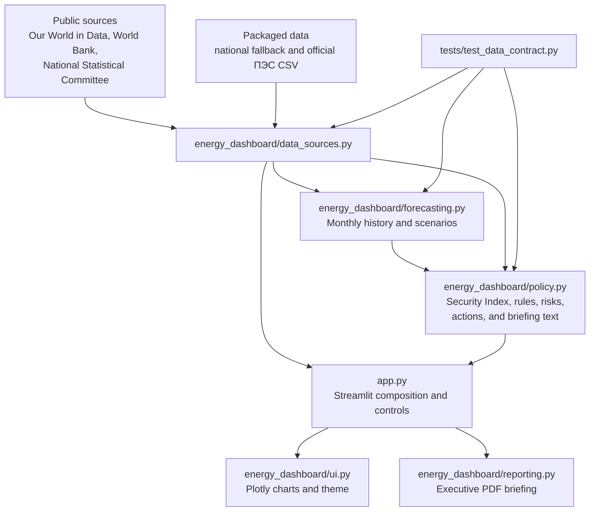

# Kyrgyzstan Energy Intelligence Dashboard

A Streamlit-based electricity intelligence and policy-support dashboard for the Kyrgyz Republic.

The dashboard brings national electricity monitoring, scenario forecasting, regional planning indicators, explainable policy rules, recommended actions, and a downloadable executive briefing into one interface. It is designed as a transparent planning prototype—not as a real-time dispatch system or an official Ministry methodology.

## Project Purpose

Electricity data is most useful when decision-makers can connect it to practical questions:

- Is domestic generation keeping pace with demand?
- How dependent is the system on electricity imports?
- What changes under dry, normal, and wet hydropower conditions?
- Which regional indicators deserve planning attention?
- Why was a particular action recommended?
- Which results are official, estimated, or demonstration-only?

The project aims to make those questions easier to answer while keeping formulas, assumptions, triggers, and data limitations visible.

## Intended Users

The dashboard is intended for:

- Ministry leadership and non-technical policy staff
- Electricity-sector planners and analysts
- Government briefing and coordination teams
- Development partners and energy-policy researchers
- Technical reviewers evaluating data contracts, methods, and deployment readiness

It can support monitoring, scenario discussion, and meeting preparation. It should not be used for dispatch, procurement, investment approval, or binding policy decisions without official operational data and expert validation.

## Key Features

- Executive situation panel with current status, main risk driver, key concern, and outlook
- National production, consumption, trade, generation-mix, and balance monitoring
- Clear distinction between the domestic production gap and the balance after trade
- Explainable 0–100 Energy Security Index with a component breakdown
- Auditable policy-rule thresholds and current trigger values
- Recommended actions with the evidence behind each recommendation
- “What Changed Since Last Year?” year-over-year insights
- Dry, Normal, and Wet year Scenario Impact Analysis
- Seasonal demand forecasts with confidence bands and peak-demand indicators
- Official 2024 useful electricity supply by ПЭС service territory
- Regional population, derived per-capita supply, national-demand share, provenance, and data-quality labels
- Downloadable Executive Energy Briefing PDF
- Live public-data loading with packaged fallback data

## Architecture



## Module Breakdown

| Module | Responsibility |
| --- | --- |
| `app.py` | Streamlit entry point, controls, page composition, tables, and downloads |
| `energy_dashboard/data_sources.py` | Public data loaders, fallback data, derived national metrics, and regional planning indicators |
| `energy_dashboard/forecasting.py` | Synthetic monthly history, Holt-Winters forecasting, confidence bands, and scenario multipliers |
| `energy_dashboard/policy.py` | Energy Security Index, policy rules, year-over-year insights, scenario impacts, and recommended actions |
| `energy_dashboard/reporting.py` | ReportLab generation of the Executive Energy Briefing PDF |
| `energy_dashboard/ui.py` | Plotly charts, visual definitions, and Streamlit theme helpers |
| `data/regional_useful_supply_2024.csv` | Official 2024 useful electricity supply by ПЭС service territory |
| `docs/MINISTRY_ONE_PAGER.md` | Non-technical Ministry handoff document |
| `tests/test_data_contract.py` | Data, forecast, policy, and regional contract checks |

## Data Sources and Data Quality

### National electricity data

The primary live national source is the [Our World in Data energy dataset](https://github.com/owid/energy-data), used for available annual electricity generation, demand, hydropower, fossil generation, net electricity imports, and population fields.

The [World Bank Open Data API](https://data.worldbank.org/country/kyrgyz-republic) supplements population and electricity-access indicators where available.

If public endpoints are unavailable, the application uses packaged starter national data for 2000–2024 so that the interface remains usable. The sidebar identifies sources as live or fallback.

Displayed “Loaded at” timestamps indicate when the application requested the data. They are not source-publication dates.

### Regional population

Regional population uses [official public estimates from the National Statistical Committee of the Kyrgyz Republic](https://stat.gov.kg/media/files/4c29e08a-580e-42d4-92c6-65cdf5a1554c.pptx). The current mapping represents population as of January 1, 2025, used as the end-2024 population position.

### Data-quality classifications

The Regional View separates metrics into three categories:

| Classification | Meaning |
| --- | --- |
| **Official** | Directly sourced from an official public statistical source |
| **Derived** | Calculated transparently from official useful supply and other identified inputs |
| **Not available** | Not published in the official regional source and not estimated |

ПЭС useful supply and regional population are classified as **Official**. Per-capita supply and share of national demand are **Derived**. Regional production, losses, balance, status, and risk ranking are **Not available**.

## National Electricity Metrics

The dashboard calculates:

```python
domestic_gap_twh = production_twh - consumption_twh
net_balance_twh = production_twh + imports_twh - consumption_twh - exports_twh
net_imports_twh = imports_twh - exports_twh
hydro_share_pct = hydro_twh / production_twh * 100
```

- **Domestic gap** shows whether domestic production covers consumption before trade.
- **Net balance** includes imports and exports.
- **Net imports** measure imports minus exports.
- **Hydropower share** indicates dependence on hydropower within domestic generation.

## Energy Security Index Methodology

The Energy Security Index is an explainable policy prototype scored from 0 to 100:

| Component | Maximum contribution | Interpretation |
| --- | ---: | --- |
| Production coverage | 35 | Rewards domestic production coverage relative to consumption |
| Hydropower dependency | 20 | Reduces the score when hydropower reliance creates dry-year exposure |
| Recent demand growth | 20 | Reduces the score when demand grows quickly |
| Forecast reserve margin | 25 | Rewards a larger supply cushion relative to forecast demand |

Risk bands:

- **Secure:** 75 or higher
- **Moderate Risk:** 50–74.9
- **High Risk:** below 50

The dashboard displays each component’s weight, current indicator, contribution, and explanation. Policy rules separately show the thresholds crossed by domestic deficit, import dependency, hydropower vulnerability, demand growth, and forecast reserve margin.

The weights, thresholds, and risk bands have not been formally adopted by the Ministry. They require review and calibration by energy-sector experts before operational use.

## Forecasting Methodology

Forecasting is implemented in `energy_dashboard/forecasting.py`.

Because the available public electricity series is annual, the application creates an estimated monthly history using:

- Winter-weighted monthly electricity demand
- Separate monthly hydropower seasonality weights
- Up to ten years of recent annual observations

The primary forecast uses Holt-Winters exponential smoothing with:

- Additive trend
- Multiplicative seasonality
- A 12-month seasonal period

If model fitting fails, the application falls back to a seasonal average with a simple trend. Confidence bands use the fitted residual standard deviation and a `1.64` multiplier.

Planning scenarios apply the existing demand and hydropower multipliers:

| Scenario | Demand multiplier | Hydropower availability index |
| --- | ---: | ---: |
| Normal year | 1.00 | 1.00 |
| Dry year | 1.04 | 0.88 |
| Wet year | 0.98 | 1.08 |

Scenario Impact Analysis compares forecast demand, the unchanged Security Index, risk level, estimated net balance, and key concern across all three scenarios.

### Forecast limitations

- Monthly history is estimated from annual data rather than observed monthly demand.
- Confidence bands are statistical approximations, not calibrated probabilistic forecasts.
- The model does not currently include reservoir levels, inflows, snowpack, weather, plant availability, outages, fuel constraints, or network constraints.
- Forecasts are planning aids and should not be treated as dispatch instructions.

## Regional Planning Layer and Limitations

The Regional View loads the official 2024 Settlement Center schema:

```text
year
region
source_region_label
territory_type
lat
lon
useful_supply_gwh
metric
data_quality
data_provenance
source_organization
source_document
source_url
```

The application adds population and derives:

```python
demand_per_capita_kwh = useful_supply_gwh * 1_000_000 / population
demand_share_pct = useful_supply_gwh / national_demand_gwh * 100
```

Important limitations:

- Values are ПЭС network service-territory figures, not guaranteed strict oblast boundaries.
- Ошское ПЭС is published as one territory; Osh City is not reported separately.
- Production and distribution losses are unavailable and are not estimated.
- Balance, producer/consumer status, and regional risk ranking are disabled.
- Per-capita supply and national-demand share are derived comparisons, not official statistics or an energy-balance reconciliation.
- Map coordinates support visualization and are not network-asset locations.

The useful-supply values are official public data, but the regional layer remains unsuitable for balance, loss, or risk assessment until compatible official production and loss data are available.

## Local Run Instructions

Requirements:

- Python 3.11 or a compatible version
- Internet access for live public sources; fallback data is used when requests fail

```bash
python3 -m venv .venv
source .venv/bin/activate
pip install -r requirements.txt
streamlit run app.py
```

Open the local URL displayed by Streamlit, normally `http://localhost:8501`.

## Deployment Setup

The repository is configured for Streamlit Community Cloud with:

- `app.py`
- `requirements.txt`
- `runtime.txt`
- `.streamlit/config.toml`

Deployment steps:

1. Push the repository to GitHub.
2. Sign in to [Streamlit Community Cloud](https://share.streamlit.io).
3. Create an application from the repository.
4. Set the main file path to `app.py`.
5. Deploy or reboot the application.

If private Ministry APIs or databases are added, store credentials in Streamlit secrets or an approved secret-management system. Do not commit credentials to the repository.

## Testing

Install development dependencies:

```bash
pip install -r requirements-dev.txt
```

Run compilation checks:

```bash
python3 -m compileall app.py energy_dashboard tests
```

Run the full test suite:

```bash
python3 -m pytest -q
```

If `pytest` is not installed, run the current contract tests directly:

```bash
python3 -c "from tests.test_data_contract import test_national_data_contract, test_regional_data_contract, test_forecast_contract, test_security_index_contract, test_policy_rules_contract, test_actions_do_not_use_unavailable_regional_risk; test_national_data_contract(); test_regional_data_contract(); test_forecast_contract(); test_security_index_contract(); test_policy_rules_contract(); test_actions_do_not_use_unavailable_regional_risk(); print('checks passed')"
```

## Screenshots

> Add final screenshots after deployment. Recommended files and views are listed below.

### Executive situation briefing


### Scenario Impact Analysis


### Regional planning layer


### Executive Energy Briefing PDF


## Ministry Handoff Roadmap

### Data readiness

- Extend the official ПЭС useful-supply series and obtain compatible official production and loss data.
- Connect observed monthly demand, generation, imports, exports, and losses.
- Add reservoir levels, inflows, snowpack, weather, outages, maintenance, and plant availability.
- Record source publication dates and revision status, not only application load times.
- Add automated validation, reconciliation, and missing-data alerts.

### Methodology validation

- Review Security Index weights, thresholds, and risk bands with sector experts.
- Define an approved regional-risk methodology.
- Calibrate forecast uncertainty using observed monthly errors.
- Validate recommended actions and escalation rules against Ministry procedures.

### Operational integration

- Add secure database or API connections and access controls.
- Introduce data ownership, approval, and update workflows.
- Add infrastructure, capacity, outage, and project trackers.
- Establish audit logs and versioned methodology documentation.
- Complete security, reliability, and user-acceptance testing before operational adoption.

### Communication and reporting

- Add verified screenshots and a live deployment link.
- Embed selected charts in the PDF briefing.
- Add Kyrgyz and Russian language support if required.
- Provide user guidance, data dictionaries, and analyst training materials.

## Current Readiness

The dashboard is suitable for demonstration, policy-method discussion, portfolio review, and preparation for Ministry data integration. It is not yet an official operational energy-management system. Its strongest current value is transparency: data provenance, formulas, scenario assumptions, policy thresholds, and limitations are made visible so they can be reviewed and improved.
